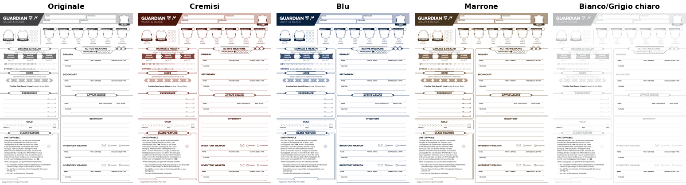
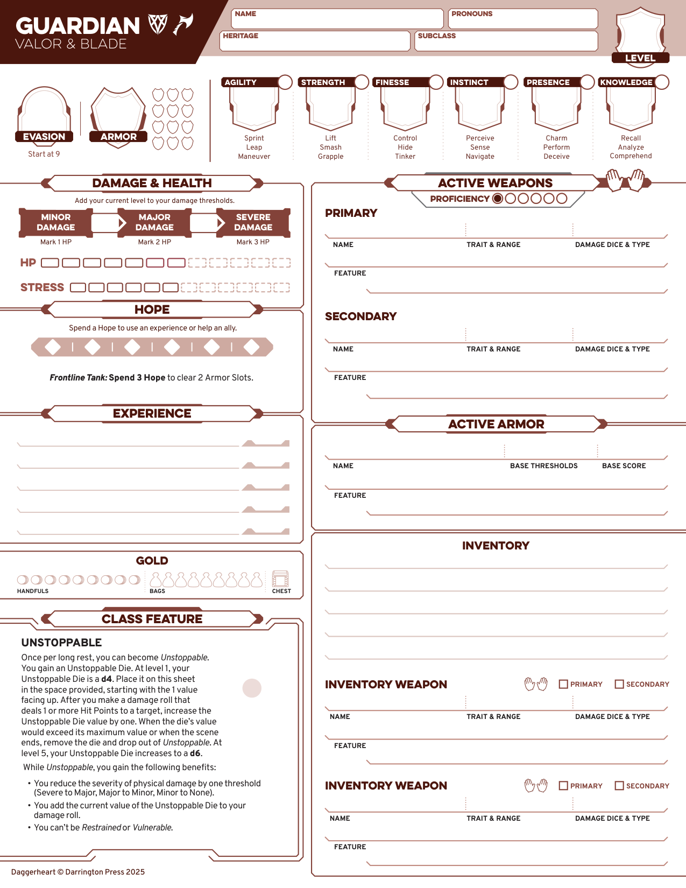

# Recolor PDF

A small Python script that remaps the grayscale/black color palette of a
vector PDF to a different hue, while keeping all text and line art
perfectly sharp.

Built originally to recolor the official Daggerheart character sheets
(black/gray design) into custom tabletop-friendly palettes, but it works
on any vector PDF that uses neutral (gray/black) fills and strokes.

## Why not just use Krita / Photoshop / GIMP?

Raster editors treat a PDF as a flat image. Selecting "the gray pixels"
and shifting their hue also touches anti-aliased text edges and vector
borders, degrading their sharpness.

This script instead works on the PDF's actual drawing instructions
(the *content stream*), rewriting color operators directly:

```
0 0 0 0.7 k        ->  0.42 0.05 0.12 0.55 k
0.43 0.43 0.44 RG  ->  0.71 0.32 0.38 RG
```

Since text and shapes stay vector, nothing loses sharpness — only the
color values change.

## Examples

Same page, five different palettes — text and line art stay sharp in
every version:



Full-resolution detail of the crimson variant:



## Requirements

- Python 3.9+
- [`pikepdf`](https://pikepdf.readthedocs.io/)

```bash
pip install pikepdf
```

## Usage

```bash
python3 recolor_pdf.py <input.pdf> <output.pdf> <color>
```

`<color>` accepts three formats:

**1. A numeric hue (0–1), for fine control**

```bash
python3 recolor_pdf.py Schede_player.pdf output.pdf 0.6
```

The value is a position on the color wheel: `0`/`1` = red, `0.33` =
green, `0.6` = blue, `0.83` = magenta, and so on.

**2. A named color (Italian or English, case-insensitive)**

```bash
python3 recolor_pdf.py Schede_player.pdf output.pdf Rosso
python3 recolor_pdf.py Schede_player.pdf output.pdf red
```

Supported names:

| Italian | English |
|---|---|
| Blu | Blue |
| Rosso | Red |
| Giallo | Yellow |
| Verde | Green |
| Viola | Purple |
| Arancione | Orange |
| Rosa | Pink |
| Azzurro | SkyBlue |
| Marrone | Brown |
| Nero / GrigioScuro | Black / DarkGray |
| Bianco / GrigioChiaro | White / LightGray |

**3. `All` (or `Tutti`) — generate every named variant at once**

```bash
python3 recolor_pdf.py Schede_player.pdf output.pdf All
```

Produces `output_blue.pdf`, `output_red.pdf`, `output_yellow.pdf`, ...
one file per color in the table above.

## How it works

1. **Walks every content stream** in the PDF: each page's own drawing
   instructions, plus any nested Form XObjects (used for backgrounds,
   icons, decorative shapes). This is done recursively, since some
   PDFs nest Form XObjects inside other Form XObjects.
2. **Finds color-setting operators** via regex: `k`/`K` (CMYK fill/
   stroke), `rg`/`RG` (RGB fill/stroke), `g`/`G` (grayscale fill/
   stroke).
3. **Filters for "grayish" colors only** — i.e. colors where R≈G≈B
   (low chroma). Colors that are already saturated are left untouched.
4. **Preserves relative luminance.** Each gray's lightness (`L`) is
   computed, and a new color is generated at the same `L` but with the
   requested hue, using HLS color space. This keeps the original
   design's visual hierarchy intact — dark headers stay dark, light
   borders stay light — only the hue changes.
5. **Leaves near-white untouched** (`L ≥ 0.985`), so the page
   background and any white text on dark headers keep working.
6. **`Black`/`DarkGray`** is a no-op: the sheet is already in that
   palette, so it's kept mainly as a baseline when using `All`.
7. **`White`/`LightGray`** lightens backgrounds and decorative grays,
   but explicitly skips very dark tones (`L < 0.08`) — in these sheets
   that range is almost always body text, and lightening it would hurt
   readability.
8. Rewrites each modified stream back into the PDF with `pikepdf` and
   saves the result.

## Tuning

All the named-color definitions live in `COLOR_DEFS` near the top of
the script — hue, max saturation, and (for `Brown`) a lightness cap so
it doesn't drift into orange on lighter grays. Add new entries there
(and matching aliases in `ALIASES`) to define more presets.

## Known limitations

- Only works on **vector** PDFs with explicit color operators. A
  scanned/rasterized PDF (image-only pages) won't be affected.
- Colors defined via ICC profiles, separations, or indexed color
  spaces (`cs`/`CS`, `sc`/`SC`, `scn`/`SCN`) aren't handled — only
  plain `DeviceGray`, `DeviceRGB`, and `DeviceCMYK` operators.
- The gray/non-gray split is a simple chroma threshold; a design that
  mixes near-gray brand colors with true neutrals may need the
  threshold in `is_grayish()` adjusted.
